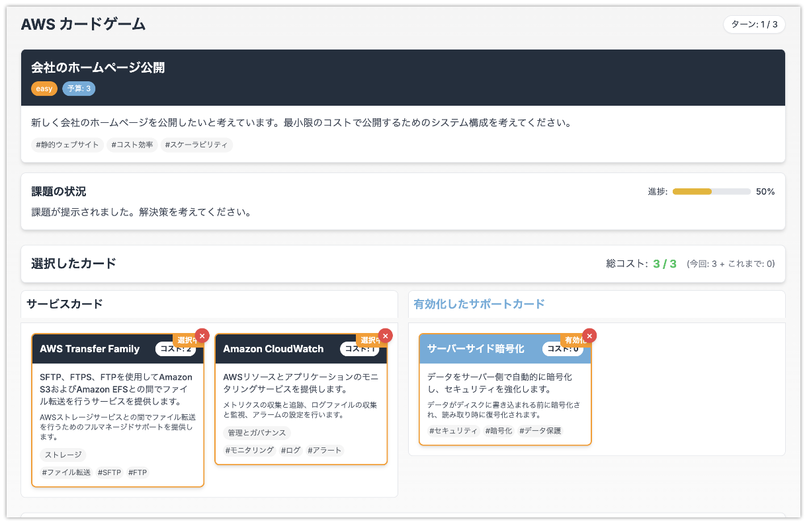

# AWS カードゲーム



AWSのサービスを使って課題を解決するカードゲームです。ゲームマスターが提示したシステム構成に関する課題に対し、プレイヤーは自分の手札から解決策になるカードを提出することで、課題を解決することを目指します。

## ゲームの目的

ゲームマスターが提示したシステム構成に関する課題に対し、プレイヤーは自分の手札から解決策になるカードを提出することで、課題を解決することを目指すゲームです。

## ゲームモード

ゲーム開始時に以下のモードを選択できます。

* **AWSサービス全般**: これまで通り、幅広いAWSサービスのカードと一般的な課題が登場します。
* **Systems Manager専用**: AWS Systems Managerの機能カードのみでプレイするモードです。課題もSystems Managerで解決可能なものに限定されます。

## ゲームルール

* 一人用のゲームです。
* プレイヤーは最初に10枚のサービスカードが手札として配られます。
* また、プレイヤーはサポートカードを5枚持っています。
* ゲームマスターはシステム構成に関する課題を最初に1つ提示します。課題に解決の予算(コスト)も提示します。
* プレイヤーは3ターンの間に、課題を解決することを目指します。カードを提出することで課題の状況を改善し、最終的に課題を解決することが目標です。
* プレイヤーは手札からカード(サービスカード)を選び、課題に対する解決策として提出します。提出したカードは手札から除外されます。
* サービスカードは1度に3枚まで選択することができます。
* プレイヤーは直接課題を解決するサービスカードの他に、サポートカードを有効化することがで来ます。有効化したサポートカードは消費されません。
* カードにはコストが設定されており、サービスカードとサポートカードは使用するとコストを消費します。最初に課題と共に提示されたコスト内で解決策を提出する必要があります。
* ゲームマスターはプレイヤーが提出したカードをターン毎に評価し、課題の状況の変化をプレイヤーにフィードバックします。
* ゲームマスターが最初に提示したコストを超えてカードを提出することもできますが、評価は低くなります。
* プレイヤーは自分のターンでサービスカードを任意の枚数選んで捨てることができます。捨てたカードの枚数に応じて、次のターンで引くカードの枚数が増えます。
* プレイヤーは自分のターンをスキップすることがでます。スキップした場合、課題の状況が若干悪化します。
* 捨てることができるカードはサービスカードのみで、サポートカードは捨てることができません。

## 技術スタック

* フロントエンド: React.js + Next.js
* スタイリング: TailwindCSS
* インフラストラクチャ: AWS CDK (AppRunner)
* AI: Amazon Bedrock (Claude)

## ローカル開発

### 必要条件

* Node.js 18以上
* npm 9以上
* AWS CLI (デプロイ時)
* AWS CDK (デプロイ時)

### インストール

```bash
# 依存関係のインストール
npm install
```

### 開発サーバーの起動

```bash
npm run dev
```

ブラウザで http://localhost:3000 を開いてアプリケーションを確認できます。

## デプロイ

### 簡易デプロイ手順

#### 1. 前提条件

* AWS CLIがインストールされ、適切に設定されていること
* AWS CDKがインストールされていること (`npm install -g aws-cdk`)
* デプロイ先のAWSアカウントに対する適切な権限があること
* Bedrockサービスが有効化されていること
* Dockerがインストールされていること

#### 2. ECRリポジトリの作成とDockerイメージのプッシュ

```bash
# ECRリポジトリを作成
aws ecr create-repository --repository-name aws-card-game --region ap-northeast-1

# AWSにログイン
aws ecr get-login-password --region ap-northeast-1 | docker login --username AWS --password-stdin $(aws sts get-caller-identity --query Account --output text).dkr.ecr.ap-northeast-1.amazonaws.com

# Dockerイメージをビルド
docker build -t aws-card-game .

# ECRリポジトリのURIを取得
ECR_REPO=$(aws sts get-caller-identity --query Account --output text).dkr.ecr.ap-northeast-1.amazonaws.com/aws-card-game

# イメージにタグ付け
docker tag aws-card-game:latest ${ECR_REPO}:latest

# ECRにプッシュ
docker push ${ECR_REPO}:latest
```

#### 3. CDKプロジェクトの準備

```bash
# CDKディレクトリに移動
cd cdk

# 依存関係のインストール
npm install

# AWSアカウントにCDKをブートストラップ（初回のみ）
cdk bootstrap aws://ACCOUNT-NUMBER/REGION
```

#### 4. CDKスタックのデプロイ

```bash
# CDKディレクトリ内で実行
cd cdk

# スタックの変更内容を確認（オプション）
cdk diff

# スタックをデプロイ（プロファイルとリージョンを指定）
AWS_REGION=ap-northeast-1 cdk deploy
```

デプロイが完了すると、以下の出力が表示されます：
- ECRリポジトリURI (`ECRRepositoryUri`)
- AppRunnerサービスのURL (`AppRunnerServiceUrl`)

デプロイ完了後、AppRunnerサービスのURLにアクセスしてアプリケーションが正常に動作していることを確認してください。これには数分かかることがあります。

### 環境変数のカスタマイズ

CDKスタック（`cdk/lib/aws-card-game-stack.ts`）で以下の環境変数を設定できます：

```typescript
runtimeEnvironmentVariables: [
  {
    name: 'NEXT_PUBLIC_AWS_REGION',
    value: this.region,
  },
  {
    name: 'NEXT_PUBLIC_BEDROCK_MODEL_ID',
    value: 'anthropic.claude-3-haiku-20240307-v1:0', // 使用するモデルIDを変更可能
  },
],
```

### リソースの削除

```bash
# CDKディレクトリに移動
cd cdk

# スタックを削除
cdk destroy

# ECRリポジトリを削除（必要に応じて）
aws ecr delete-repository --repository-name aws-card-game --force --region ap-northeast-1
```

## 環境変数

アプリケーションには以下の環境変数が必要です：

* `NEXT_PUBLIC_AWS_REGION`: AWSリージョン（例: ap-northeast-1）
* `NEXT_PUBLIC_BEDROCK_MODEL_ID`: BedrockのモデルID（例: anthropic.claude-3-haiku-20240307-v1:0）

## ライセンス

MIT
